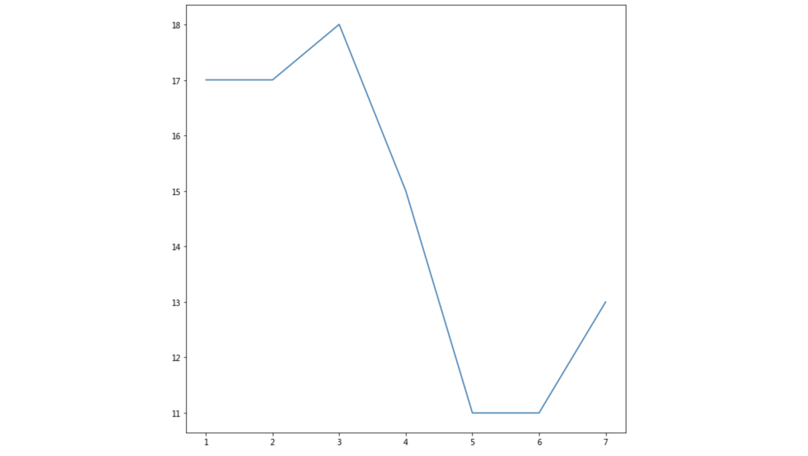
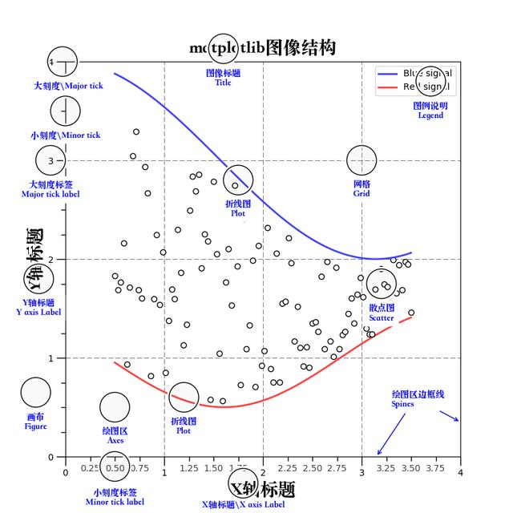

# 3.1 Matplotlib之HelloWorld

## 学习目标

* 目标
  * 了解什么是matplotlib
  * 为什么要学习matplotlib
  * matplotlib简单图形的绘制

---

## 1 什么是Matplotlib


* 是专门用于开发2D图表(包括3D图表)


* 以渐进、交互式方式实现数据可视化


## 2 为什么要学习Matplotlib

可视化是在整个数据挖掘的关键辅助工具，可以清晰的理解数据，从而调整我们的分析方法。

* 能将数据进行可视化,更直观的呈现
* 使数据更加客观、更具说服力

例如下面两个图为数字展示和图形展示：


## 3 实现一个简单的Matplotlib画图 — 以折线图为例

### 3.1 matplotlib.pyplot模块

matplotlib.pytplot包含了一系列类似于matlab的画图函数。

```python
import matplotlib.pyplot as plt
```

### 3.2 图形绘制流程：

- 1.创建画布 -- plt.figure()

- ```
  plt.figure(figsize=(), dpi=)
      figsize:指定图的长宽
      dpi:图像的清晰度
      返回fig对象
  ```

- 2.绘制图像 -- plt.plot(x, y)

- ```
  以折线图为例
  ```

- 3.显示图像 -- plt.show()

### 3.3 折线图绘制与显示

**举例：展现上海一周的天气,比如从星期一到星期日的天气温度如下**

```python
import matplotlib.pyplot as plt

# 1.创建画布
plt.figure(figsize=(10, 10), dpi=100)

# 2.绘制折线图
plt.plot([1, 2, 3, 4, 5, 6 ,7], [17,17,18,15,11,11,13])

# 3.显示图像
plt.show()
```




## 4 认识Matplotlib图像结构(了解)



## 5 小结

- 什么是matplotlib【了解】
  - 是专门用于开发2D(3D)图表的包
- 绘制图像流程【掌握】
  - 1.创建画布 -- plt.figure(figsize=(20,8))
  - 2.绘制图像 -- plt.plot(x, y)
  - 3.显示图像 -- plt.show()