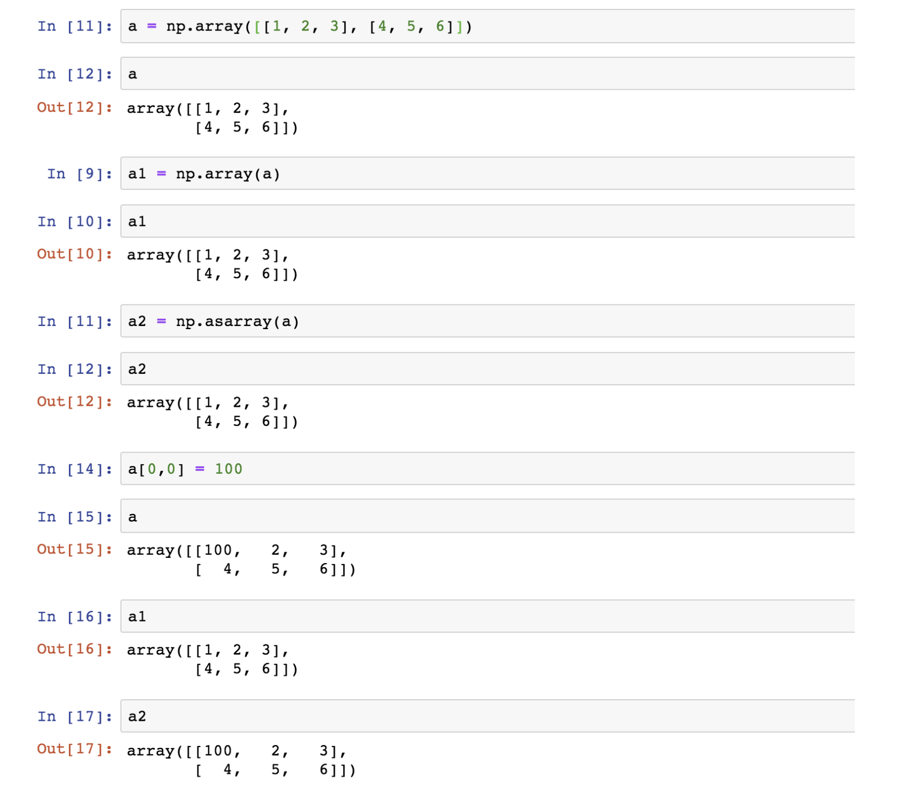
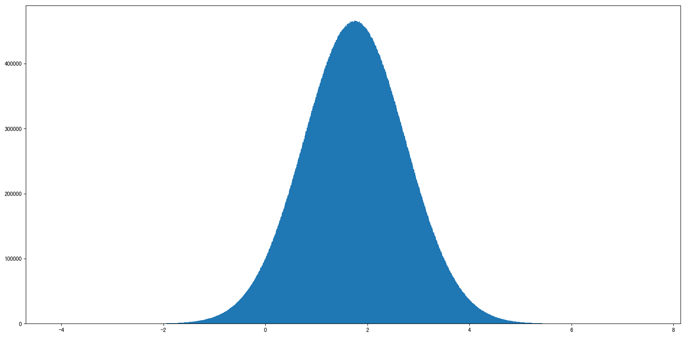
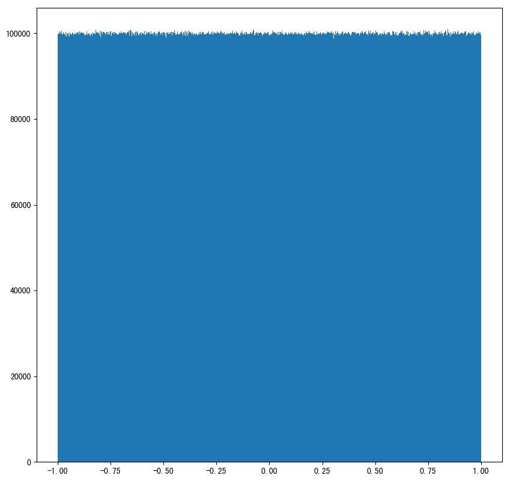

# 4.3 基本操作

##学习目标

- 目标
  - 理解数组的各种生成方法
  - 应用数组的索引机制实现数组的切片获取
  - 应用维度变换实现数组的形状改变
  - 应用类型变换实现数组类型改变
  - 应用数组的转换

---

## 1 生成数组的方法

### 1.1 生成0和1的数组

* **np.ones(shape, dtype)**
* np.ones_like(a, dtype)
* **np.zeros(shape, dtype)**
* np.zeros_like(a, dtype)	
  

```python
ones = np.ones([4,8])
ones
```

返回结果:

```python
array([[1., 1., 1., 1., 1., 1., 1., 1.],
       [1., 1., 1., 1., 1., 1., 1., 1.],
       [1., 1., 1., 1., 1., 1., 1., 1.],
       [1., 1., 1., 1., 1., 1., 1., 1.]])
```

```python
np.zeros_like(ones)
```

返回结果:

```python
array([[0., 0., 0., 0., 0., 0., 0., 0.],
       [0., 0., 0., 0., 0., 0., 0., 0.],
       [0., 0., 0., 0., 0., 0., 0., 0.],
       [0., 0., 0., 0., 0., 0., 0., 0.]])
```


### 1.2 从现有数组生成

#### 1.2.1 生成方式

* **np.array(object, dtype)**

- **np.asarray(a, dtype)**

```python
a = np.array([[1,2,3],[4,5,6]])
# 从现有的数组当中创建
a1 = np.array(a)
# 相当于索引的形式，并没有真正的创建一个新的
a2 = np.asarray(a)
```

#### 1.2.2 关于array和asarray的不同




### 1.3 生成固定范围的数组

#### 1.3.1 np.linspace (start, stop, num, endpoint)

* 创建等差数组 — 指定数量
* 参数:
  * start:序列的起始值
  * stop:序列的终止值
  * num:要生成的等间隔样例数量，默认为50
  * endpoint:序列中是否包含stop值，默认为ture

```python
# 生成等间隔的数组
np.linspace(0, 100, 11)
```

返回结果：

```python
array([  0.,  10.,  20.,  30.,  40.,  50.,  60.,  70.,  80.,  90., 100.])
```

#### 1.3.2 np.arange(start,stop, step, dtype)

* 创建等差数组 — 指定步长
* 参数
  * step:步长,默认值为1

```python
np.arange(10, 50, 2)
```

返回结果：

```python
array([10, 12, 14, 16, 18, 20, 22, 24, 26, 28, 30, 32, 34, 36, 38, 40, 42,
       44, 46, 48])
```

#### 1.3.3 np.logspace(start,stop, num)

- 创建等比数列

- 参数:
  - num:要生成的等比数列数量，默认为50

```python
# 生成10^x
np.logspace(0, 2, 3) 
```

返回结果:

```shell
array([  1.,  10., 100.])
```


### 1.4 生成随机数组

#### 1.4.1 使用模块介绍

* np.random模块

#### 1.4.2 正态分布

##### 一、基础概念复习：正态分布（理解）

##### a. 什么是正态分布

正态分布是一种概率分布。正态分布是具有两个参数μ和σ的连续型随机变量的分布，第一参数μ是服从正态分布的随机变量的均值，第二个参数σ是此随机变量的标准差，所以正态分布记作**N(μ，σ )**。


##### b. 正态分布的应用

生活、生产与科学实验中很多随机变量的概率分布都可以近似地用正态分布来描述。

##### c. 正态分布特点

**μ决定了其位置，其标准差σ**决定了分布的幅度。当μ = 0,σ = 1时的正态分布是标准正态分布。

标准差如何来？

- ###### 方差

是在概率论和统计方差衡量一组数据时离散程度的度量


其中M为平均值，n为数据总个数，σ 为标准差，σ ^2​可以理解一个整体为方差


- ###### **标准差与方差的意义**

可以理解成数据的一个离散程度的衡量


##### 二、正态分布创建方式

- np.random.randn(*d0, d1, …, dn*)

  功能：从标准正态分布中返回一个或多个样本值 

- **np.random.normal(*loc=0.0*, *scale=1.0*, *size=None*)**

  loc：float 

  ​	此概率分布的均值（对应着整个分布的中心centre）

  scale：float

  ​	此概率分布的标准差（对应于分布的宽度，scale越大越矮胖，scale越小，越瘦高） 

  size：int or tuple of ints 

  ​	输出的shape，默认为None，只输出一个值

- np.random.standard_normal(*size=None*)

  返回指定形状的标准正态分布的数组。

##### 举例1：生成均值为1.75，标准差为1的正态分布数据，100000000个

```python
x1 = np.random.normal(1.75, 1, 100000000)
```

返回结果：

```python
array([2.90646763, 1.46737886, 2.21799024, ..., 1.56047411, 1.87969135,
       0.9028096 ])
```

```python
# 生成均匀分布的随机数
x1 = np.random.normal(1.75, 1, 100000000)

# 画图看分布状况
# 1）创建画布
plt.figure(figsize=(20, 10), dpi=100)

# 2）绘制直方图
plt.hist(x1, 1000)

# 3）显示图像
plt.show()
```



例如：我们可以模拟生成一组股票的涨跌幅的数据

##### 举例2：随机生成4支股票1周的交易日涨幅数据

4支股票，**一周(5天)**的涨跌幅数据，如何获取？

- 随机生成涨跌幅在某个正态分布内，比如均值0，方差1

##### 股票涨跌幅数据的创建

```python
# 创建符合正态分布的4只股票5天的涨跌幅数据
stock_change = np.random.normal(0, 1, (4, 5))
stock_change
```

返回结果：

```python
array([[ 0.0476585 ,  0.32421568,  1.50062162,  0.48230497, -0.59998822],
       [-1.92160851,  2.20430374, -0.56996263, -1.44236548,  0.0165062 ],
       [-0.55710486, -0.18726488, -0.39972172,  0.08580347, -1.82842225],
       [-1.22384505, -0.33199305,  0.23308845, -1.20473702, -0.31753223]])
```


#### 1.4.2 均匀分布

- np.random.rand(*d0*, *d1*, *...*, *dn*)
  - 返回**[0.0，1.0)**内的一组均匀分布的数。
- **np.random.uniform(*low=0.0*, *high=1.0*, *size=None*)**
  - 功能：从一个均匀分布[low,high)中随机采样，注意定义域是左闭右开，即包含low，不包含high.  
  - 参数介绍:
    - low: 采样下界，float类型，默认值为0；
    - high: 采样上界，float类型，默认值为1；
    - size: 输出样本数目，为int或元组(tuple)类型，例如，size=(m,n,k), 则输出m*n*k个样本，缺省时输出1个值。  
  - 返回值：ndarray类型，其形状和参数size中描述一致。
- np.random.randint(*low*, *high=None*, *size=None*, *dtype='l'*)
  - 从一个均匀分布中随机采样，生成一个整数或N维整数数组，
  - 取数范围：若high不为None时，取[low,high)之间随机整数，否则取值[0,low)之间随机整数。

```python
# 生成均匀分布的随机数
x2 = np.random.uniform(-1, 1, 100000000)
```

返回结果：

```python
array([ 0.22411206,  0.31414671,  0.85655613, ..., -0.92972446,
0.95985223,  0.23197723])
```

画图看分布状况：

```python
import matplotlib.pyplot as plt

# 生成均匀分布的随机数
x2 = np.random.uniform(-1, 1, 100000000)

# 画图看分布状况
# 1）创建画布
plt.figure(figsize=(10, 10), dpi=100)

# 2）绘制直方图
plt.hist(x=x2, bins=1000)  # x代表要使用的数据，bins表示要划分区间数

# 3）显示图像
plt.show()
```



## 2 数组的索引、切片

一维、二维、三维的数组如何索引？

* 直接进行索引,切片
* 对象[:, :] -- 先行后列

二维数组索引方式：

- 举例：获取第一个股票的前3个交易日的涨跌幅数据

```python
# 二维的数组，两个维度 
stock_change[0, 0:3]
```

返回结果：

```python
array([-0.03862668, -1.46128096, -0.75596237])
```

- 三维数组索引方式：


```python
# 三维
a1 = np.array([ [[1,2,3],[4,5,6]], [[12,3,34],[5,6,7]]])
# 返回结果
array([[[ 1,  2,  3],
        [ 4,  5,  6]],

       [[12,  3, 34],
        [ 5,  6,  7]]])
# 索引、切片
>>> a1[0, 0, 1]   # 输出: 2
```


## 3 形状修改

### 3.1 ndarray.reshape(shape, order)

* 返回一个具有相同数据域，但shape不一样的**视图**
* 行、列不进行互换

```python
# 在转换形状的时候，一定要注意数组的元素匹配
stock_change.reshape([5, 4])
stock_change.reshape([-1,10])  # 数组的形状被修改为: (2, 10), -1: 表示通过待计算
```

### 3.2 ndarray.resize(new_shape)

* 修改数组本身的形状（需要保持元素个数前后相同）
* 行、列不进行互换

```python
stock_change.resize([5, 4])

# 查看修改后结果
stock_change.shape
(5, 4)
```
### 3.3 ndarray.T

* 数组的转置
* 将数组的行、列进行互换

```python
stock_change.T.shape
(4, 5)
```


## 4 类型修改

### 4.1 ndarray.astype(type)

* 返回修改了类型之后的数组

```python
stock_change.astype(np.int32)
```

### 4.2 ndarray.tostring([order])或者ndarray.tobytes([order]) 

* 构造包含数组中原始数据字节的Python字节

```python
arr = np.array([[[1, 2, 3], [4, 5, 6]], [[12, 3, 34], [5, 6, 7]]])
arr.tostring()
```

### 4.3 jupyter输出太大可能导致崩溃问题【了解】

如果遇到

```
IOPub data rate exceeded.
    The notebook server will temporarily stop sending output
    to the client in order to avoid crashing it.
    To change this limit, set the config variable
    `--NotebookApp.iopub_data_rate_limit`.
```

这个问题是在jupyer当中对输出的字节数有限制，需要去修改配置文件

创建配置文件

```python
jupyter notebook --generate-config
vi ~/.jupyter/jupyter_notebook_config.py
```

取消注释,多增加

```python
## (bytes/sec) Maximum rate at which messages can be sent on iopub before they
#  are limited.
c.NotebookApp.iopub_data_rate_limit = 10000000
```

**但是不建议这样去修改，jupyter输出太大会崩溃**


## 5 数组的去重

### 5.1 np.unique()

```python
temp = np.array([[1, 2, 3, 4],[3, 4, 5, 6]])
>>> np.unique(temp)
array([1, 2, 3, 4, 5, 6])
```


## 6 小结

- 创建数组【掌握】
  
  - 生成0和1的数组
    - np.ones()
    - np.ones_like()
  - 从现有数组中生成
    - np.array -- 深拷贝
    - np.asarray -- 浅拷贝
  - 生成固定范围数组
    - np.linspace()
      - nun -- 生成等间隔的多少个
    - np.arange()
      - step -- 每间隔多少生成数据
    - np.logspace()
      - 生成以10的N次幂的数据
  
  - 生层随机数组
    - 正态分布
      - 里面需要关注的参数:均值:u, 标准差:σ
        - u -- 决定了这个图形的左右位置
        - σ -- 决定了这个图形是瘦高还是矮胖
      - np.random.randn()
      - np.random.normal(0, 1, 100)
    - 均匀
      - np.random.rand()
      - np.random.uniform(0, 1, 100)
      - np.random.randint(0, 10, 10)
  
- 数组索引【知道】
  - 直接进行索引,切片
  - 对象[:, :] -- 先行后列
  
- 数组形状改变【掌握】
  - 对象.reshape()
    - 没有进行行列互换,新产生一个ndarray
  - 对象.resize()
    - 没有进行行列互换,修改原来的ndarray
  - 对象.T
    - 进行了行列互换
  
- 数组去重【知道】
  
  - np.unique(对象)