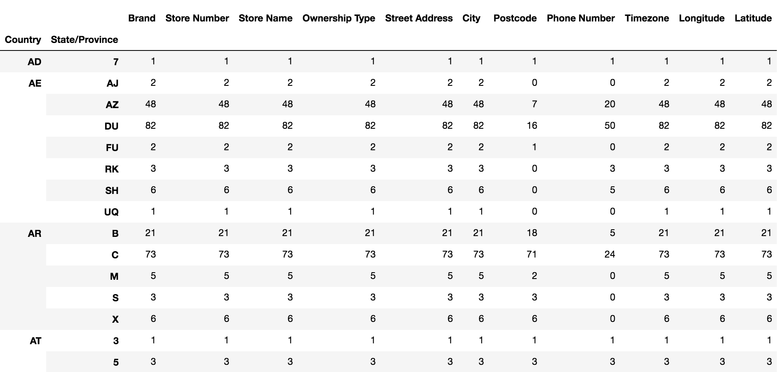
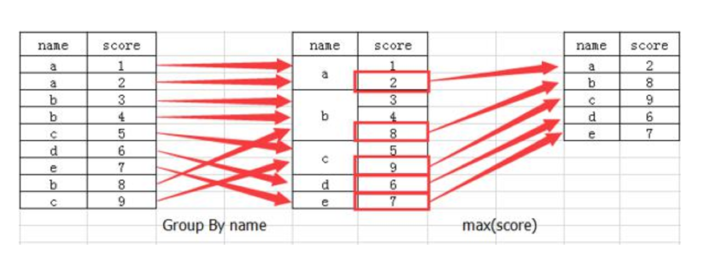

# 5.11 高级处理-分组与聚合

## 学习目标

- 目标 
  - 应用groupby和聚合函数实现数据的分组与聚合

----

**分组与聚合通常是分析数据的一种方式，通常与一些统计函数一起使用，查看数据的分组情况**

想一想其实刚才的交叉表与透视表也有分组的功能，所以算是分组的一种形式，只不过他们主要是计算次数或者计算比例！！看其中的效果：



## 1 什么分组与聚合



## 2 分组API

* DataFrame.groupby(key,  as_index=False)
  * key:分组的列数据，可以多个
* 案例:不同颜色的不同笔的价格数据

```python
col =pd.DataFrame({'color': ['white','red','green','red','green'], 'object': ['pen','pencil','pencil','ashtray','pen'],'price1':[5.56,4.20,1.30,0.56,2.75],'price2':[4.75,4.12,1.60,0.75,3.15]})

color	object	price1	price2
0	white	pen	5.56	4.75
1	red	pencil	4.20	4.12
2	green	pencil	1.30	1.60
3	red	ashtray	0.56	0.75
4	green	pen	2.75	3.15
```

* 进行分组，对颜色分组，price进行聚合

```python
# 分组，求平均值
col.groupby(['color'])['price1'].mean()
col['price1'].groupby(col['color']).mean()

color
green    2.025
red      2.380
white    5.560
Name: price1, dtype: float64

# 分组，数据的结构不变
col.groupby(['color'], as_index=False)['price1'].mean()

color	price1
0	green	2.025
1	red	2.380
2	white	5.560
```

## 3 星巴克零售店铺数据

现在我们有一组关于全球星巴克店铺的统计数据，如果我想知道美国的星巴克数量和中国的哪个多，或者我想知道中国每个省份星巴克的数量的情况，那么应该怎么办？

> 数据来源：https://www.kaggle.com/starbucks/store-locations/data


### 3.1 数据获取

从文件中读取星巴克店铺数据

```python
# 导入星巴克店的数据
starbucks = pd.read_csv("./data/starbucks/directory.csv")
```

### 3.2 进行分组聚合

```python
# 按照国家分组，求出每个国家的星巴克零售店数量
count = starbucks.groupby(['Country']).count()
```

**画图显示结果**

```python
count['Brand'].plot(kind='bar', figsize=(20, 8))
plt.show()
```


假设我们加入省市一起进行分组

```python
# 设置多个索引，set_index()
starbucks.groupby(['Country', 'State/Province']).count()
```


**仔细观察这个结构，与我们前面讲的哪个结构类似？？**

与前面的MultiIndex结构类似

## 4  小结

* groupby进行数据的分组【知道】
  * pandas中，抛开聚合谈分组，无意义