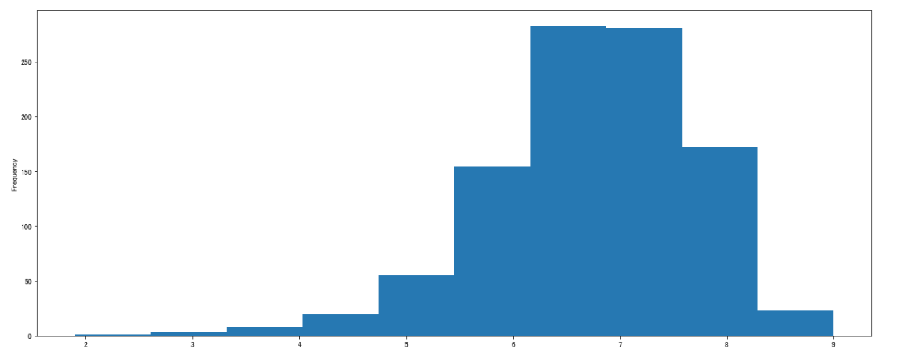
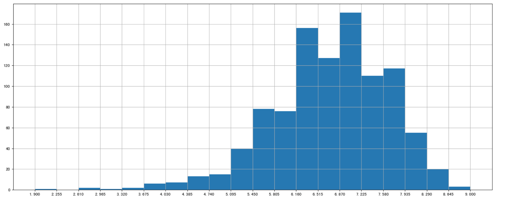
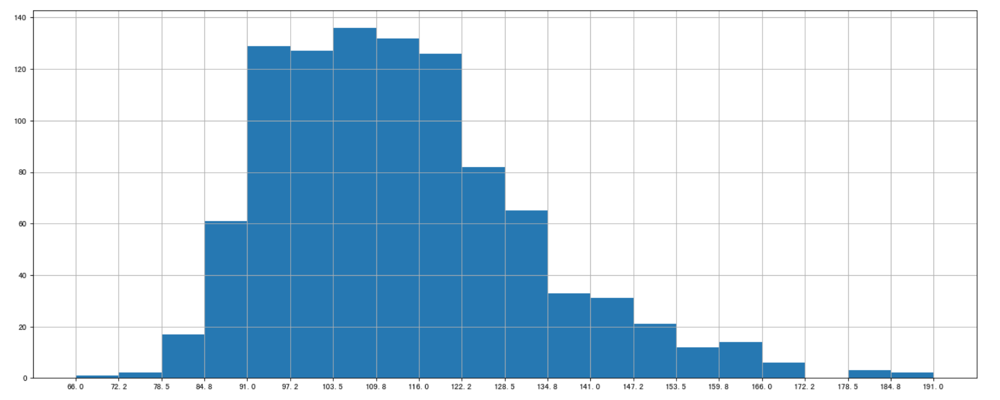
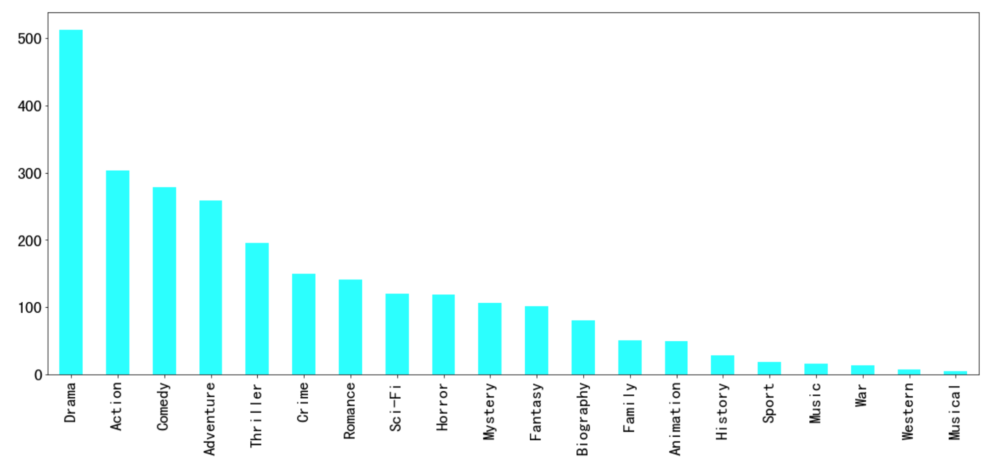

# 5.12 案例

## 学习目标

- 目标 
  - 无

---

## 1 需求

现在我们有一组从2006年到2016年1000部最流行的电影数据

数据来源：https://www.kaggle.com/damianpanek/sunday-eda/data

* 问题1：我们想知道这些电影数据中评分的平均分，导演的人数等信息，我们应该怎么获取？
* 问题2：对于这一组电影数据，如果我们想rating，runtime的分布情况，应该如何呈现数据？
* 问题3：对于这一组电影数据，如果我们希望统计电影分类(genre)的情况，应该如何处理数据？

## 2 实现

首先获取导入包，获取数据

```
%matplotlib inline
import pandas  as pd 
import numpy as np
from matplotlib import pyplot as plt
```

```python
#文件的路径
path = "./data/IMDB-Movie-Data.csv"
#读取文件
df = pd.read_csv(path)
```

### 2.1 问题一：

**我们想知道这些电影数据中评分的平均分，导演的人数等信息，我们应该怎么获取？** 

* 得出评分的平均分

使用mean函数

```python
df["Rating"].mean()
```

* 得出导演人数信息

求出唯一值，然后进行形状获取

```python
## 导演的人数
# df["Director"].unique().shape[0]
np.unique(df["Director"]).shape[0]

644
```

### 2.2 问题二：

**对于这一组电影数据，如果我们想Rating，Runtime (Minutes)的分布情况，应该如何呈现数据？**

* 直接呈现，以直方图的形式

选择分数列数据，进行plot

```python
df["Rating"].plot(kind='hist',figsize=(20,8))
```



* Rating进行分布展示

进行绘制直方图

```python
plt.figure(figsize=(20,8),dpi=80)
plt.hist(df["Rating"].values,bins=20)
plt.show()
```

修改刻度的间隔

```python
# 求出最大最小值
max_ = df["Rating"].max()
min_ = df["Rating"].min()

# 生成刻度列表
t1 = np.linspace(min_,max_,num=21)

# [ 1.9    2.255  2.61   2.965  3.32   3.675  4.03   4.385  4.74   5.095  5.45   5.805  6.16   6.515  6.87   7.225  7.58   7.935  8.29   8.645  9.   ]

# 修改刻度
plt.xticks(t1)

# 添加网格
plt.grid()
```



* Runtime (Minutes)进行分布展示

进行绘制直方图

```python
plt.figure(figsize=(20,8),dpi=80)
plt.hist(df["Runtime (Minutes)"].values,bins=20)
plt.show()
```

修改间隔

```python
# 求出最大最小值
max_ = df["Runtime (Minutes)"].max()
min_ = df["Runtime (Minutes)"].min()

# # 生成刻度列表
t1 = np.linspace(min_,max_,num=21)

# 修改刻度
plt.xticks(np.linspace(min_,max_,num=21))

# 添加网格
plt.grid()

```



### 2.3 问题三：

**对于这一组电影数据，如果我们希望统计电影分类(genre)的情况，应该如何处理数据？**

* 思路分析
  * 思路
    * 1、创建一个全为0的dataframe，列索引置为电影的分类，temp_df
    * 2、遍历每一部电影，temp_df中把分类出现的列的值置为1
    * 3、求和
* 1、创建一个全为0的dataframe，列索引置为电影的分类，temp_df

```python
# 进行字符串分割
temp_list = [i.split(",") for i in df["Genre"]]
# 获取电影的分类
genre_list = np.unique([i for j in temp_list for i in j]) 

# 增加新的列
temp_df = pd.DataFrame(np.zeros([df.shape[0],genre_list.shape[0]]),columns=genre_list)
```

* 2、遍历每一部电影，temp_df中把分类出现的列的值置为1

```python
for i in range(1000):
    #temp_list[i] ['Action','Adventure','Animation']
    temp_df.ix[i,temp_list[i]]=1
print(temp_df.sum().sort_values())
```

* 3、求和,绘图

```python
temp_df.sum().sort_values(ascending=False).plot(kind="bar",figsize=(20,8),fontsize=20,colormap="cool")


Musical        5.0
Western        7.0
War           13.0
Music         16.0
Sport         18.0
History       29.0
Animation     49.0
Family        51.0
Biography     81.0
Fantasy      101.0
Mystery      106.0
Horror       119.0
Sci-Fi       120.0
Romance      141.0
Crime        150.0
Thriller     195.0
Adventure    259.0
Comedy       279.0
Action       303.0
Drama        513.0
dtype: float64
```



