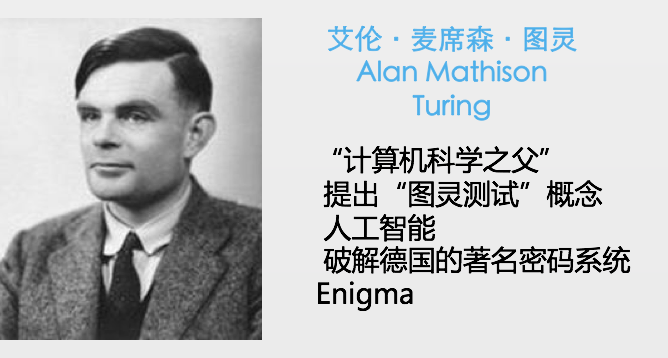
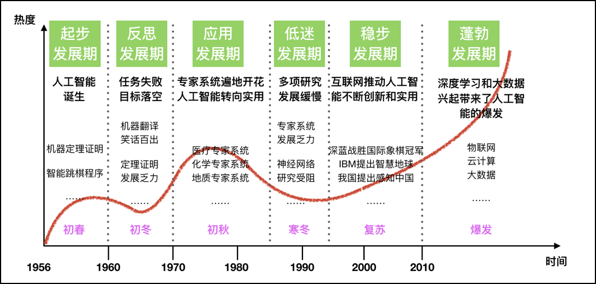

# 1.2 人工智能发展历程

## 学习目标

- 了解人工智能阶段发展历程

------

## 1 人工智能的起源

### 1.1 图灵测试

测试者与被测试者（一个人和一台机器）隔开的情况下，通过一些装置（如键盘）向被测试者随意提问。

多次测试（一般为**5min**之内），如果有超过**30%**的测试者不能确定被测试者是人还是机器，那么这台机器就通过了测试，并被认为具有**人类智能**。

### 1.2 达特茅斯会议

1956年8月，在美国汉诺斯小镇宁静的达特茅斯学院中，

​	约翰·麦卡锡（John McCarthy）

​	马文·闵斯基（Marvin Minsky，人工智能与认知学专家）

​	克劳德·香农（Claude Shannon，信息论的创始人）

​	艾伦·纽厄尔（Allen Newell，计算机科学家）

​	赫伯特·西蒙（Herbert Simon，诺贝尔经济学奖得主）等科学家正聚在一起，讨论着一个完全不食人间烟火的主题：

**用机器来模仿人类学习以及其他方面的智能。**

会议足足开了两个月的时间，虽然大家没有达成普遍的共识，但是却为会议讨论的内容起了一个名字：

​	**人工智能**

**因此，1956年也就成为了人工智能元年。**

## 2 发展历程

人工智能充满未知的探索道路曲折起伏。如何描述人工智能自1956年以来60余年的发展历程，学术界可谓仁者见仁、智者见智。我们将人工智能的发展历程划分为以下6个阶段：

- **第一是起步发展期：1956年—20世纪60年代初。**

  人工智能概念提出后，相继取得了一批令人瞩目的研究成果，如机器定理证明、跳棋程序等，掀起人工智能发展的第一个高潮。

- **第二是反思发展期：20世纪60年代—70年代初。**

  人工智能发展初期的突破性进展大大提升了人们对人工智能的期望，人们开始尝试更具挑战性的任务，并提出了一些不切实际的研发目标。然而，接二连三的失败和预期目标的落空（例如，无法用机器证明两个连续函数之和还是连续函数、机器翻译闹出笑话等），使人工智能的发展走入低谷。

- **第三是应用发展期：20世纪70年代初—80年代中。**

  20世纪70年代出现的专家系统模拟人类专家的知识和经验解决特定领域的问题，实现了人工智能从理论研究走向实际应用、从一般推理策略探讨转向运用专门知识的重大突破。专家系统在医疗、化学、地质等领域取得成功，推动人工智能走入应用发展的新高潮。

- **第四是低迷发展期：20世纪80年代中—90年代中。**

  随着人工智能的应用规模不断扩大，专家系统存在的应用领域狭窄、缺乏常识性知识、知识获取困难、推理方法单一、缺乏分布式功能、难以与现有数据库兼容等问题逐渐暴露出来。

- **第五是稳步发展期：20世纪90年代中—2010年。**

  由于网络技术特别是互联网技术的发展，加速了人工智能的创新研究，促使人工智能技术进一步走向实用化。1997年国际商业机器公司（简称IBM）深蓝超级计算机战胜了国际象棋世界冠军卡斯帕罗夫，2008年IBM提出“智慧地球”的概念。以上都是这一时期的标志性事件。

- **第六是蓬勃发展期：2011年至今。**

  随着大数据、云计算、互联网、物联网等信息技术的发展，泛在感知数据和图形处理器等计算平台推动以深度神经网络为代表的人工智能技术飞速发展，大幅跨越了科学与应用之间的“技术鸿沟”，诸如图像分类、语音识别、知识问答、人机对弈、无人驾驶等人工智能技术实现了从“不能用、不好用”到“可以用”的技术突破，迎来爆发式增长的新高潮。

## 3 小结

- 人工智能的起源【了解】
  - 图灵测试
  - 达特茅斯会议
- 人工智能的发展经历了六个阶段【了解】
  - 起步发展期
  - 反思发展期
  - 应用发展期
  - 低迷发展期
  - 稳步发展期
  - 蓬勃发展期