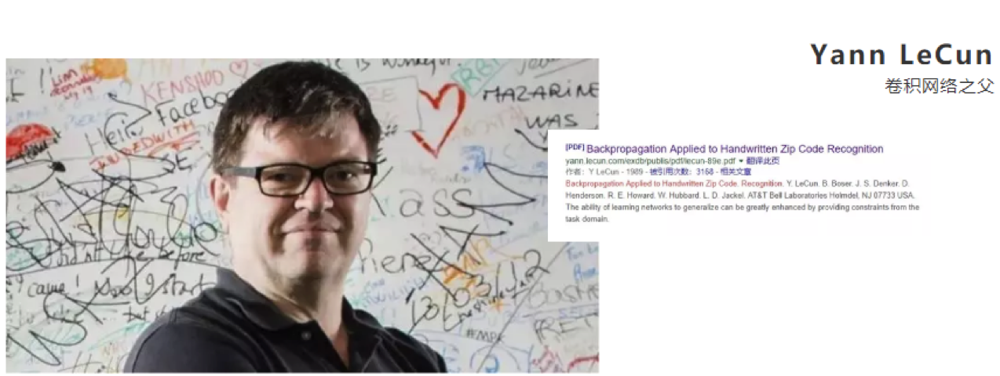
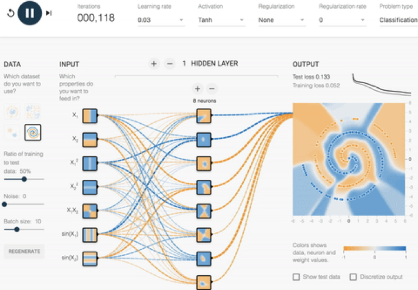
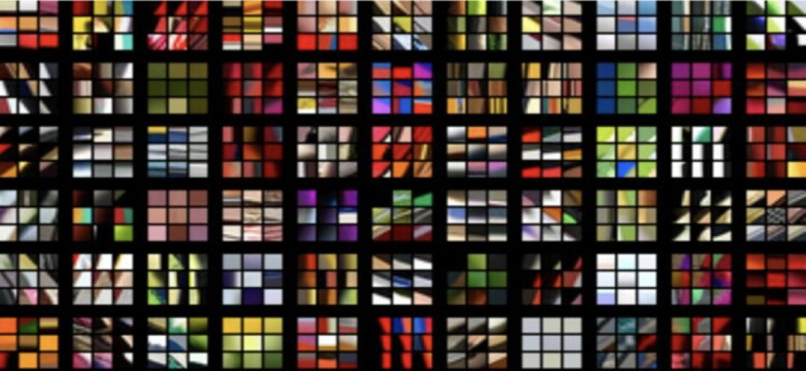
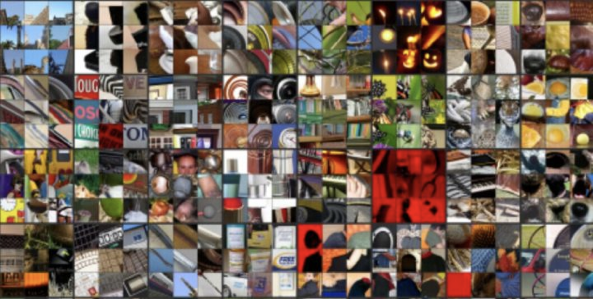
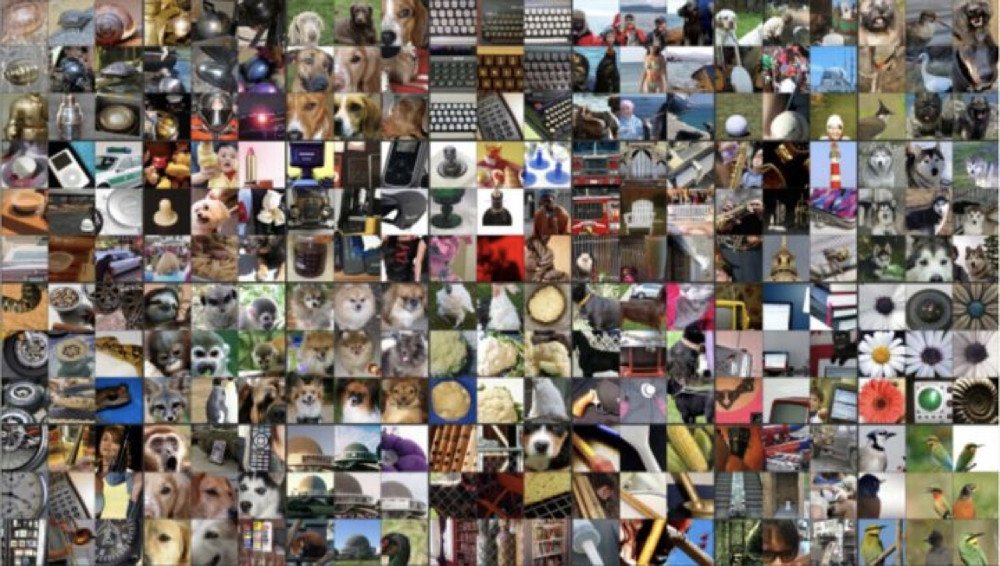

# 1.8 深度学习简介

## 学习目标

- 目标
  - 了解什么是深度学习

------

## 1 深度学习 —— 神经网络简介

深度学习（Deep Learning）（也称为深度结构学习【Deep Structured Learning】、层次学习【Hierarchical Learning】或者是深度机器学习【Deep Machine Learning】）是一类算法集合，是机器学习的一个分支。

深度学习方法近年来，在会话识别、图像识别和对象侦测等领域表现出了惊人的准确性。

但是，“深度学习”这个词语很古老，它在1986年由Dechter在机器学习领域提出，然后在2000年有Aizenberg等人引入到人工神经网络中。而现在，由于Alex Krizhevsky在2012年使用卷积网络结构赢得了ImageNet比赛之后受到大家的瞩目。

卷积网络之父：Yann LeCun

- 深度学习演示

  - [链接:http://playground.tensorflow.org  ](http://playground.tensorflow.org  )

## 2 深度学习各层负责内容

神经网络各层负责内容：

**1层：负责识别颜色及简单纹理**

**2层：一些神经元可以识别更加细化的纹理，布纹，刻纹，叶纹等**

**3层：一些神经元负责感受黑夜里的黄色烛光，高光，萤火，鸡蛋黄色等。**

**4层：一些神经元识别萌狗的脸，宠物形貌，圆柱体事物，七星瓢虫等的存在。**

**5层：一些神经元负责识别花，黑眼圈动物，鸟，键盘，原型屋顶等。**

## 4 小结

- 深度学习的发展源头--神经网络【了解】
- 多层神经网络，在最初几层是识别简单内容，后面几层是识别一些复杂内容。【了解】